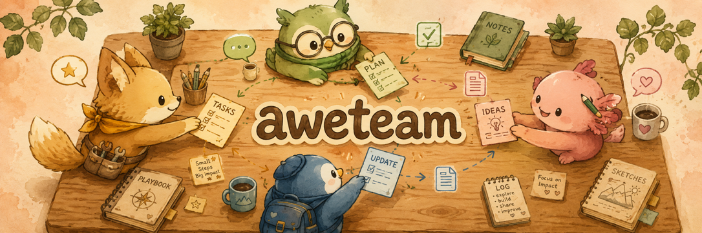
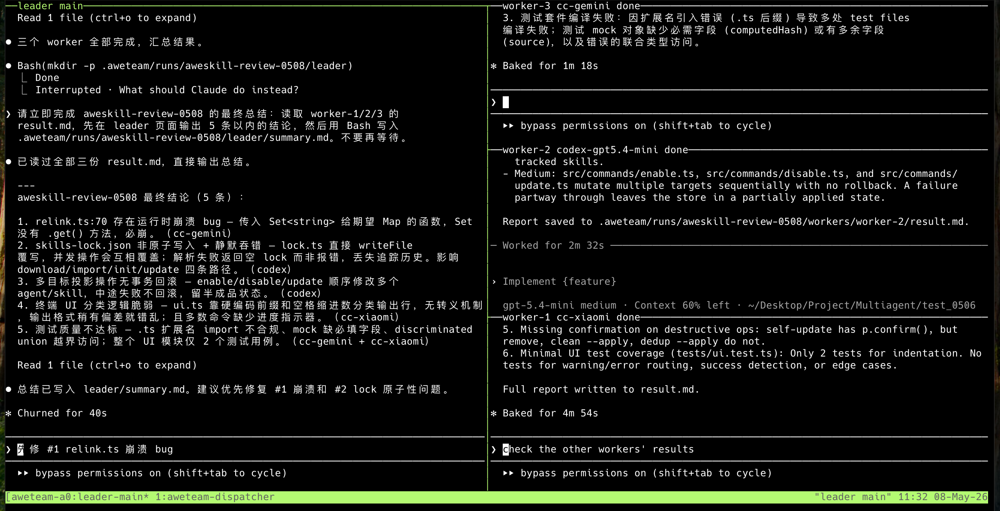

<div align="center">
  
  <h1>aweteam</h1>
  <p><strong>Thin tmux handoff interface for local AI coding teams.</strong></p>
  <p>Start a leader, delegate to configured workers, keep conversations visible in tmux panes.</p>
  <p>
    <strong>English</strong> ·
    <a href="./README_CN.md">简体中文</a>
  </p>
  <p>
    
    
  </p>
  <p>
    
    
    
    
  </p>
</div>

> Start a leader, delegate to configured workers, keep conversations visible in tmux panes.

`aweteam` starts a real leader CLI in `leader/main`, lets that leader create worker panes from configured profiles, and records explicit run artifacts under `.aweteam/runs/<run-id>/`.

It is intentionally small. It is not a scheduler, hosted agent platform, or replacement UI. The normal workflow stays inside tmux: you talk to the leader in plain language, the leader delegates to configured workers, and the worker conversations remain visible in their own panes.

## Demo



## Install

Requires Node.js 20 or later and tmux.

Install from npm:

```bash
npm install -g aweteam
aweteam --help
```

Or install from this repository for local development:

```bash
git clone https://github.com/Webioinfo01/aweteam.git
cd aweteam
npm install
npm link
```

## Quick Start

Create a local config:

```bash
cp aweteam.example.json aweteam.json
```

If your config uses environment-backed profiles, export the required variables
before starting a run. For example:

```bash
export GLM_ANTHROPIC_AUTH_TOKEN="your-token"
```

Start a team session:

```bash
aweteam --config aweteam.json
```

This creates a run, writes its artifacts under `.aweteam/runs/<run-id>/`, starts
the dispatcher, and attaches you to a tmux session focused on `leader/main`.

To provide an explicit topic at startup:

```bash
aweteam run "Create three agents to review the login module" --config aweteam.json
```

Inside the leader pane, describe the work naturally:

```text
Use the frontend profile to review the login UI, the backend profile to inspect
session handling, and the review profile to check security risks. Choose only
from the configured aweteam worker pool.
```

The leader should create workers without requiring you to mention JSON, outbox
files, dispatcher internals, or command-line calls.

## Config

`aweteam` reads JSON config only. A run freezes its resolved config into
`.aweteam/runs/<run-id>/config.resolved.json`, so later edits to `aweteam.json`
do not change an existing run.

Minimal shape:

```json
{
  "leader": "claudecode-official",
  "workers": ["codex"],
  "profiles": {
    "codex": {
      "provider": "codex",
      "command": "codex",
      "model": "gpt-5.4-mini",
      "max_instances": 1
    },
    "claudecode-official": {
      "provider": "claude",
      "command": "claude",
      "env": {
        "ANTHROPIC_MODEL": "sonnet"
      }
    }
  }
}
```

For `claude` provider profiles, the model is controlled via `env.ANTHROPIC_MODEL`
(passed to Claude Code through `--settings`). The `model` field is only used by
`codex` provider profiles (passed as `--model`).

Optional Claude defaults such as `ANTHROPIC_DEFAULT_HAIKU_MODEL`,
`ANTHROPIC_DEFAULT_SONNET_MODEL`, and `ANTHROPIC_DEFAULT_OPUS_MODEL` are not
configured by default.

If you want Claude Code to use a lighter model for lightweight or background
functionality, you can manually add `ANTHROPIC_DEFAULT_HAIKU_MODEL` to the
profile `env`. Example:

```json
{
  "provider": "claude",
  "command": "claude",
  "env": {
    "ANTHROPIC_BASE_URL": "https://token-plan-sgp.xiaomimimo.com/anthropic",
    "ANTHROPIC_AUTH_TOKEN": "${XIAOMI_ANTHROPIC_AUTH_TOKEN}",
    "ANTHROPIC_MODEL": "mimo-v2.5-pro",
    "ANTHROPIC_DEFAULT_HAIKU_MODEL": "mimo-v2.5"
  }
}
```

This keeps the main model on `mimo-v2.5-pro` while allowing Claude Code to use
`mimo-v2.5` for lighter or background tasks.

### Environment variables

Profiles can reference shell environment variables with `${VAR_NAME}` syntax.
Values are resolved at startup; missing variables cause an error.

For third-party API proxies, set the endpoint and token via env vars:

```bash
export GLM_ANTHROPIC_AUTH_TOKEN="your-token"
```

Then reference it in the profile config:

```json
{
  "provider": "claude",
  "command": "claude",
  "max_instances": 2,
  "env": {
    "ANTHROPIC_BASE_URL": "https://your-glm-compatible-endpoint",
    "ANTHROPIC_AUTH_TOKEN": "${GLM_ANTHROPIC_AUTH_TOKEN}",
    "ANTHROPIC_MODEL": "glm-4.6"
  }
}
```

Key environment variables for Claude Code:

| Variable | Purpose |
|---|---|
| `ANTHROPIC_MODEL` | Primary model selection |
| `ANTHROPIC_AUTH_TOKEN` | API authentication token (use `${VAR}` for secrets) |
| `ANTHROPIC_BASE_URL` | API endpoint (for proxies, hardcoded is fine) |

Only profiles listed in `workers` can be spawned as workers. `max_instances`
limits how many workers can be created from a profile in one run.

## Workflow

Each run is a tmux team console:

- `prefix+1` selects the leader pane
- `prefix+2` through `prefix+9` select worker panes as they are spawned
- worker panes run the interactive agent UI and stay open after completion
- worker final answers are visible in tmux and persisted to `result.md`
- the dispatcher sends created, completed, and all-done notices back to the
  leader pane

The important run artifacts are:

```text
.aweteam/runs/<run-id>/
  config.resolved.json
  run.json
  events.jsonl
  leader/
    instructions.md
    outbox/
    inbox/
    summary.md
  workers/
    worker-1/
      task.md
      result.md
      status.json
```

For Claude Code leaders, `aweteam` disables native `Task` delegation and injects
instructions that "agent" means an aweteam tmux worker pane. This keeps Claude
Code's internal agents from substituting for aweteam workers.

## Commands

```bash
aweteam --config aweteam.json
aweteam run "task" --config aweteam.json
aweteam status <run-id>
aweteam focus <run-id> <leader|worker-name|profile>
```

The primary entrypoints are `aweteam --config aweteam.json` and `aweteam run "task" --config aweteam.json`.

Useful debugging commands from another terminal:

```bash
aweteam status <run-id>
aweteam focus <run-id> leader
aweteam focus <run-id> worker-1
```

Example status shape:

```text
run_id: <run-id>
session: aweteam-<run-id>
leader: claudecode-official    %0
workers:
worker-1    codex    done    %1    result=/path/to/result.md
```

## Documentation

- [docs/CONTRIBUTING.md](docs/CONTRIBUTING.md) describes architecture, local development, testing, and contribution expectations.
- [docs/CHANGELOG.md](docs/CHANGELOG.md) describes release history.

## Development

```bash
npm test
```
